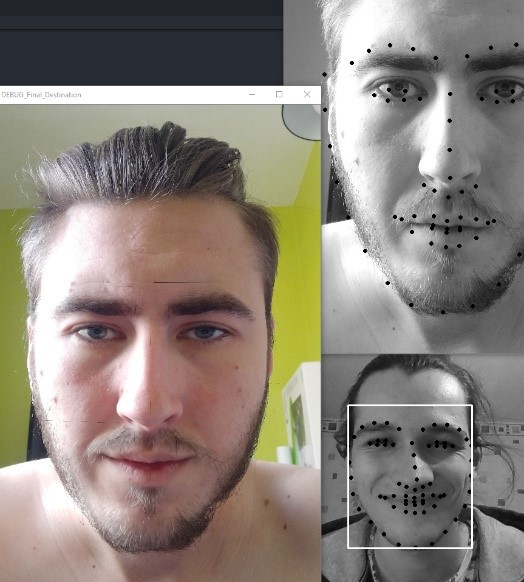

# Expression Swap
Expression Swap is like a Face Swap but with facial expressions.
The first goal of the project was to modify an image of a face to make it smile.
Then we decided to go further by swapping expressions between two faces.

## Different branches
We made multiple branches to have a proper seperation of the different results.

- **cam-to-image**

Transfer facial expressions from a face filmed by the camera to the face on a selected image.

- simple-swap

Transfer facial expressions from a face to another face both taken by the camera.

- double-swap

Swap facial expressions between two faces both taken by the camera.

## How to use Expression Swap (cam-to-image)
You must have cmake, dlib and opencv installed on your machine.

`pip install cmake`
`pip install dlib`
`pip install opencv-python`

This is the line to launch the expression swap program. You can, of course, change the image to take one of yours.

`python expression_swap.py predictor.dat example/Max.jpg`

Once the program is launched, there's an initialization phase. You need to press **_Space_** to take a picture of your face. You have to make a **poker-face** ! This initialization process permits to detect the expressions made when swapping. You can confirm your poker-face picture by pressing 'y'. If you want to take it again, you can press 'n'.

## Example image (cam-to-image)

## Why this project
This 3 months project was entirely made by Ulysse Regnier and Maximilien Chaux.
It was a project for our 3rd year of university in Claude Bernard Lyon 1.
[This page was the subject.][1]

[1]: http://perso.univ-lyon1.fr/fabien.rico/site/projet:2020:pri:sujet#am4_capture_et_transfert_d_animation_d_un_visage_vers_un_autres_par_image_warping_ou_deformation_de_maillages_3d